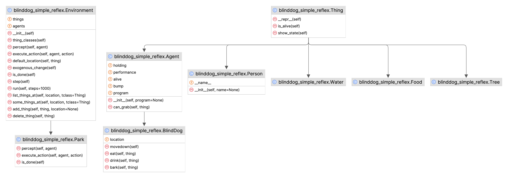
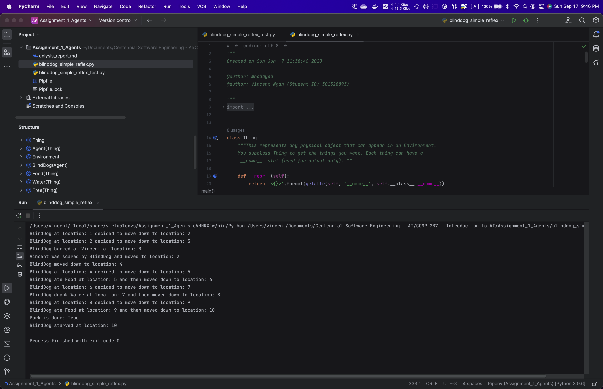
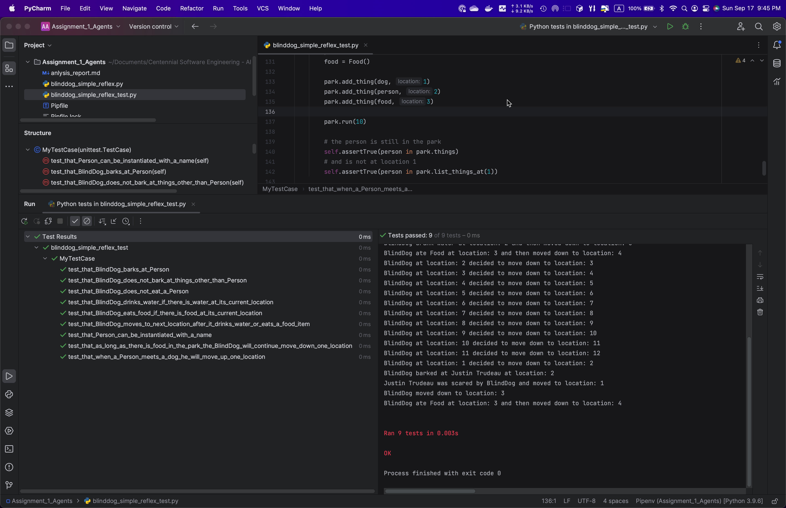
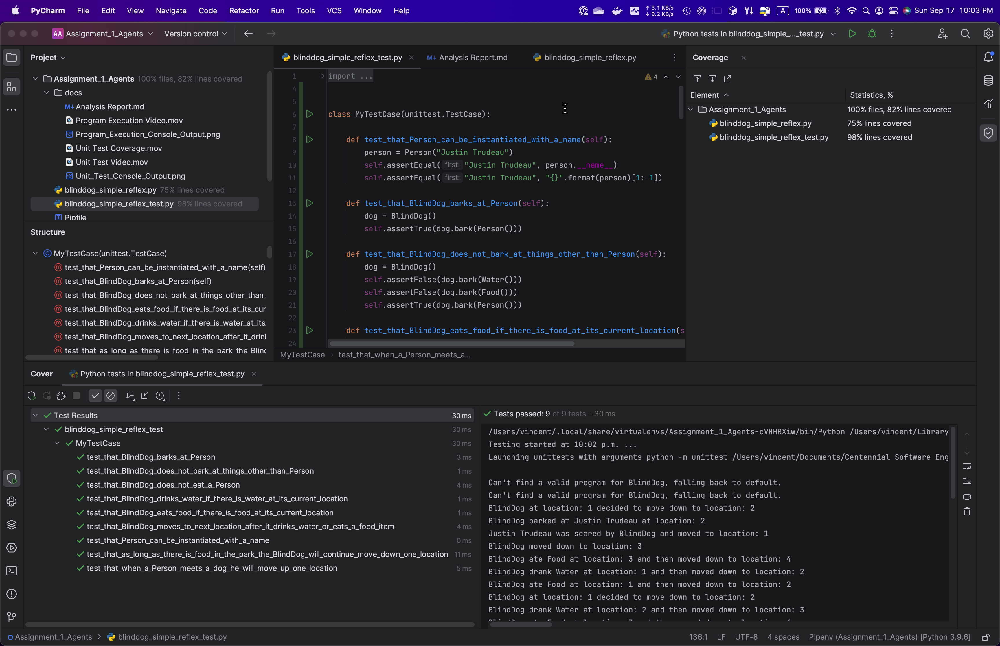

# Analysis Report for Assignment 1 - Agents

- Name: Tsang Kwong Ngan
- Student ID: 301328893
- Class: COMP237004_2023F
- Date: Sep 17, 2023

## Objectives

This report describes how the Python program "blinddog_simple_reflex.py" was modified
to meet the requirements for Assignment 1, and shows the execution results of the
finished program. It also includes an UML class digram showing all the classes
defined in the program and the relationships between them.

## Descriptions

All modifications made to the "blinddog_simple_reflex.py" file are marked with
comments showing their related requirement numbers as stated in the assignment
instructions document. The changes are as follows:

1. Add a new food item called **chicken** at location 9 in the **Park**.
   ```python
   chicken = Food()
   park.add_thing(chicken, 9)
   ```
2. Add a new class called **Person** which is a subclass of **Thing**.
   ```python
   class Person(Thing):
       def __init__(self, name=None):
           if name is not None:
               self.__name__ = name
   ```
3. Create two instances of **Person** with their names as my first name and
   last name respectively. They are added at location 3 and 9 in the **Park**.
   ```python
   person1 = Person("Vincent")
   person2 = Person("Ngan")
   park.add_thing(person1, 3)
   park.add_thing(person2, 12)
   ```
4. Add code to model the behavior a new receipt that represents how a **BlindDog**
   would bark at a **Persion**. The changes can be found in the program marked
   with comments as 4a, 4b and 4c.

   (a) Add a condition in **execute_action()** of class **Park** to handle the "bark" action:
   ```python
        #
        # 4a - Add a condition to handle the action "bark".
        # When the agent (BlindDog) encounters a thing which is of
        # type Person, it calls the bark() method to check
        # if the bark() supports this action. If yes, the program
        # goes on to move the person up one location, and move
        # the agent down one location.
        #
        elif action == "bark":
            items = self.list_things_at(agent.location, tclass=Person)
            if len(items) != 0:
                person = items[0]
                if agent.bark(person):  # Have the dog bark at the first person
                    print('{} barked at {} at location: {}'
                          .format(str(agent)[1:-1], str(person)[1:-1], agent.location))
                    # Delete person from the Park after:
                    self.delete_thing(person)
                    # Add the person back to Park at (agent.location - 1):
                    self.add_thing(person, agent.location - 1)
                    print('{} was scared by {} and moved to location: {}'
                          .format(str(person)[1:-1], str(agent)[1:-1], agent.location - 1))
                    print('{} moved down to location: {}'
                          .format(str(agent)[1:-1], agent.location + 1))
            agent.movedown()
   ```

   (b) Add a function called **bark()** in the **BlindDog** class:
   ```python
       #
       # 4b - Add a new method called bark() for BindDog to represent
       # the bark behavior of BlindDog.
       #
       def bark(self, thing):
           """
           This method models the 'bark' behavior of BlindDog.
           It returns True if the input parameter thing is an instance
           of Person; otherwise it returns False.
           """
           if isinstance(thing, Person):
               return True
           return False
   ```

   (c) Add a condition in function **program()** to handle a percept as Person:
   ```python
   def program(percepts):
       """Returns an action based on the dog's percepts"""
       for p in percepts:
           if isinstance(p, Food):
               return 'eat'
           elif isinstance(p, Water):
               return 'drink'
           #
           # 4c - Add a percept that a Person can be barked at by the BlindDog
           #
           elif isinstance(p, Person):
               return 'bark'
       return 'move down'
   ```
   
5. The program is run by setting the number of steps to 18. The status of the **Park** 
   and the **BlindDog** are printed out.
   ```python
       #
       # 5 - Run the park for 18 steps
       #
       park.run(18)
   
       print("Park is done: {}".format(park.is_done()))
   
       no_edibles = not any(
           isinstance(thing, Food) or isinstance(thing, Water)
           for thing in park.things
       )
       no_agents_alive = not any(
           agent.is_alive() for agent in park.agents
       )
       if no_edibles:
           print("{} starved at location: {}".format(str(dog)[1:-1], dog.location))
       if no_agents_alive:
           print("{} died at location: {}".format(str(dog)[1:-1], dog.location))
   ```

## Additional Details

1. The main logic of the program is moved to a new function called **main()**. This
   is to avoid the main logic being run when the program is used as a library instead
   of a main program.
   ```python
   def main():
       park = Park()
       dog = BlindDog(program)
       dogfood = Food()
       ...
   ```
2. Add a condition to check if this program is being used as a main program before
   it is run; otherwise, no execution of the main logic will be carried out.
   ```python
   if __name__ == "__main__":
       main()
   ```
3. Add a unit test program called "blinddog_simple_reflex_test.py" to provide unit
   tests for program to make sure the program meets the requirements from unit test
   point of view. The unit test program includes the following
   tests:
   ```python

       def test_that_Person_can_be_instantiated_with_a_name(self):

       def test_that_BlindDog_barks_at_Person(self):

       def test_that_BlindDog_does_not_bark_at_things_other_than_Person(self):

       def test_that_BlindDog_eats_food_if_there_is_food_at_its_current_location(self):

       def test_that_BlindDog_drinks_water_if_there_is_water_at_its_current_location(self):

       def test_that_BlindDog_moves_to_next_location_after_it_drinks_water_or_eats_a_food_item(self):

       def test_that_as_long_as_there_is_food_in_the_park_the_BlindDog_will_continue_move_down_one_location(self):

       def test_that_BlindDog_does_not_eat_a_Person(self):

       def test_that_when_a_Person_meets_a_dog_he_will_move_up_one_location(self):
   ```
   These tests may not be exhaustive, but they pretty much cover all the majority parts of the
   program. The coverage test shows that the unit tests cover 75% of the code.

## Class Diagram


<br/>

## Execution Results

1. Program Execution
   
2. Unit Test Execution
   
3. Unit Test Code Coverage
   

## Video Clips
1. [Program Execution Video](https://vngantk.github.io/public/comp237/Program_Execution_Video.mp4)
2. [Unit Test Execution Video](https://vngantk.github.io/public/comp237/Unit_Test_Video.mp4)
3. [Unit Test Coverage Video](https://vngantk.github.io/public/comp237/Unit_Test_Coverage.mp4)
